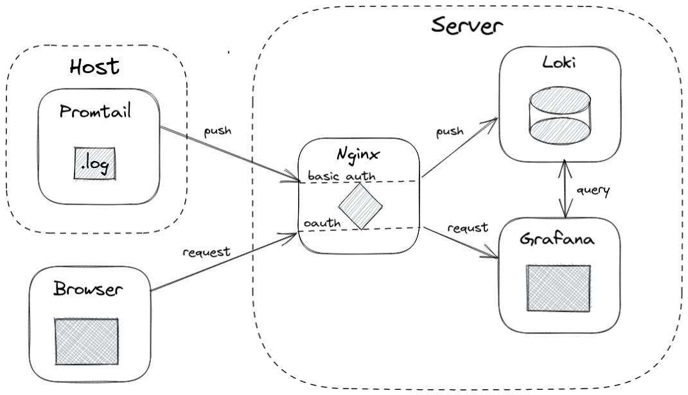

# Log-Agg-With-Loki

Log Aggregation with Grafana Loki

## Architecture

- promtail will run from a separate remote server
- loki and grafana will run in a single remote server behind nginx basic auth protection.
  - this will somewhat give a protection to our logs

## Resources

### Basic Promtail config

`wget https://raw.githubusercontent.com/grafana/loki/v2.9.1/clients/cmd/promtail/promtail-docker-config.yaml -O promtail-config.yaml`

### Basic Loki config

`wget https://raw.githubusercontent.com/grafana/loki/v2.9.1/cmd/loki/loki-local-config.yaml -O loki-config.yaml`

### Craete a htpassword

- `htpassd -c loki.htpasswd <username>`, replace with your given username
  `sudo apt install apache2-utils`
- `loki.htpasswd` file contains the username and hashed password pairs that are allowed to access this location.
- the file contains something like this: `mario:$apr1$b6emWBTo$4b5pMgcP9bdTRg9VG9//Y/` when username:`mario` and password:'test123` is given
  - to verify the password `htpasswd -vb ./loki.htpasswd  mario test123`
